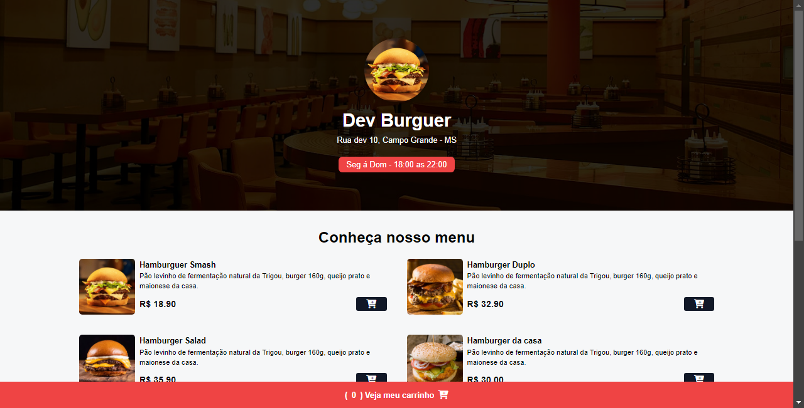

# Cardápio de Hamburgueria

## Sobre

Bem-vindo ao projeto **Cardápio de Hamburgueria**! Este projeto é uma aplicação web projetada para exibir o cardápio de uma hamburgueria, oferecendo uma maneira interativa e visualmente atraente para os clientes explorarem as opções disponíveis.

### Funcionalidades

- **Visualização de Cardápio**: Mostra uma lista de hambúrgueres, acompanhamentos e sobremesas.
- **Design Responsivo**: Adaptado para diferentes tamanhos de tela usando TailwindCSS, garantindo uma experiência de usuário otimizada em dispositivos móveis e desktop.
- **Interatividade**: Implementado com JavaScript para uma experiência de usuário dinâmica e interativa.

### Captura de Tela

Abaixo está uma captura de tela da aplicação para que você possa ver como o cardápio é exibido:

### Tecnologias Utilizadas

- **HTML**: Estrutura básica do conteúdo da página.
- **CSS**: Estilos básicos aplicados ao layout.
- **TailwindCSS**: Framework de CSS para estilização rápida e responsiva.
- **JavaScript**: Funcionalidades interativas e lógica de aplicação.